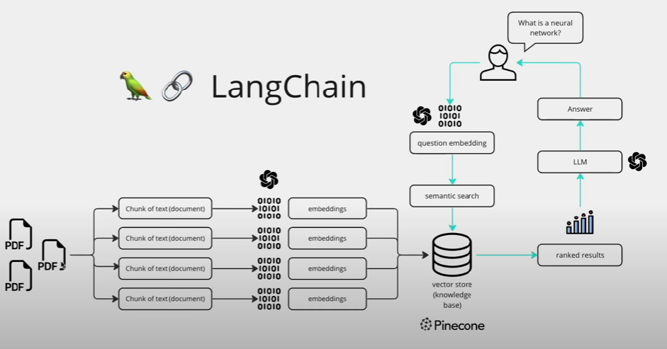
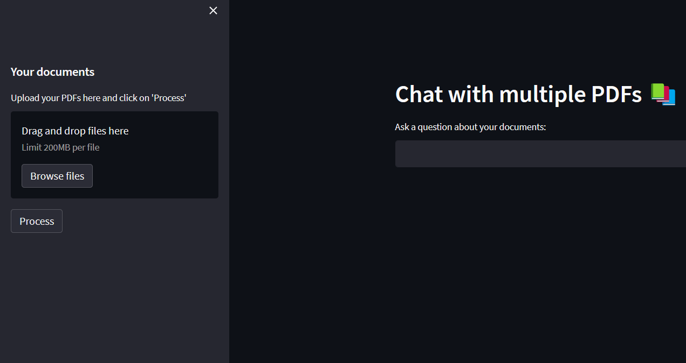

# Chat with Multiple PDFs

This project enables you to chat with multiple PDF documents using a conversational AI model. The system extracts text from uploaded PDFs, creates a vector store of the text chunks, and utilizes a conversational chain model to provide interactive chat capabilities. It is built with Streamlit, a Python framework for building web applications.




## Installation

1. Clone the repository:
git clone <repository-url>

markdown
Copy code

2. Install the required dependencies:
pip install -r requirements.txt

javascript
Copy code

3. Set up environment variables:
- Create a `.env` file in the root directory.
- Add the following variables to the `.env` file:
  ```
  VARIABLE_NAME=VALUE
  ```
  Replace `VARIABLE_NAME` with the actual variable name and `VALUE` with the corresponding value.


## Usage

1. Run the script:
streamlit run main.py

markdown
Copy code

2. Open the provided URL in your web browser.

3. **Upload PDF Documents:**
- In the sidebar, use the file uploader to upload your PDFs.
- You can upload multiple PDFs by selecting them together.

4. **Ask Questions:**
- In the main chat window, enter your question about the documents in the text input field.
- Press Enter or click outside the input field to submit the question.

5. **View Responses:**
- The system will process your question and generate a response.
- The conversation history will be displayed in the chat window.
- User messages are displayed on the left, and bot responses are displayed on the right.

6. **Explore More Questions:**
- You can ask additional questions by entering them in the text input field.
- The system will maintain the conversation history and provide relevant responses.

## Code Structure

- `main.py`: This is the main script that handles the Streamlit UI and user interactions.
- `langchain`: This directory contains the language chain implementation and related modules.
- `htmlTemplates`: This directory contains HTML templates used for displaying chat messages.

## Additional Notes

- The `ConversationChain` class from the `langchain.chains` module is used to manage the conversational flow and retrieve relevant responses.
- The `PyPDF2` library is utilized to extract text from the uploaded PDF documents.
- The `CharacterTextSplitter` class from the `langchain.text_splitter` module is used to split the extracted text into smaller chunks.
- The `OpenAIEmbeddings` class from the `langchain.embeddings` module is used to generate embeddings for the text chunks.
- The `FAISS` class from the `langchain.vectorstores` module is used to create a vector store from the text chunks and their embeddings.
- The `ChatOpenAI` class from the `langchain.chat_models` module is an alternative model for conversational responses.
- The `ConversationBufferMemory` class from the `langchain.memory` module is used to store and retrieve the conversation history.
- The `HuggingFaceHub` class from the `langchain.llms` module is used to load the conversational model from the Hugging Face model hub.

